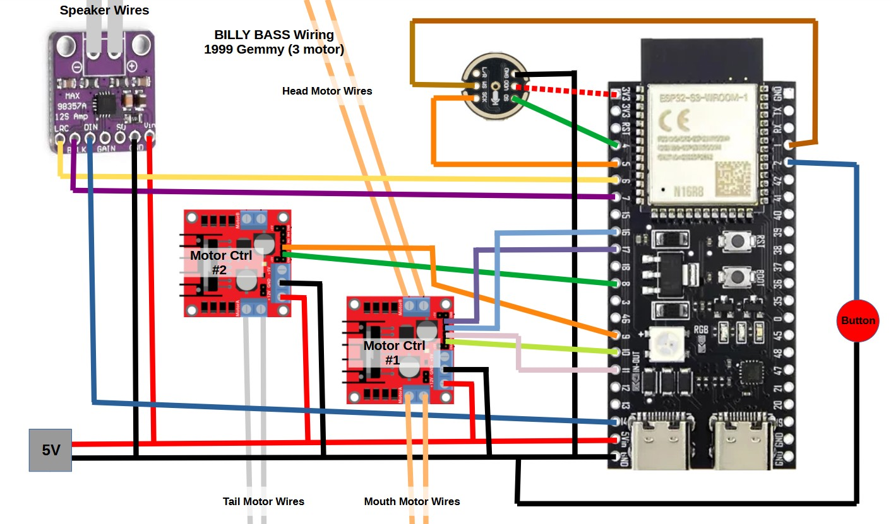

# Billy Bass Voice Assistant for Home Assistant

A Home Assistant Voice Assistant built from a Singing Big Mouth Billy Bass.

This is for the 3 motor 1999 Gemmy original bass.  Most other and newer fish use 2 motors and require slight modifications and only one motor controller.

Requires a Billy Bass, 2 motor controllers, speaker amp, and i2s microphone.  Uses an N16R8 ESP32-S6 for local wakeword and storing the songs locally on the device for more accurate animation.

Wiring as shown below:

Inspired by the [Billy-AI project here](https://github.com/Cian911/billy-ai/) Check it out for great instructions on building your own.

Uses "hey Billy" Microwakeword from [TaterTotterson](https://github.com/TaterTotterson/microWakeWords/tree/main/microWakeWordsV3)
